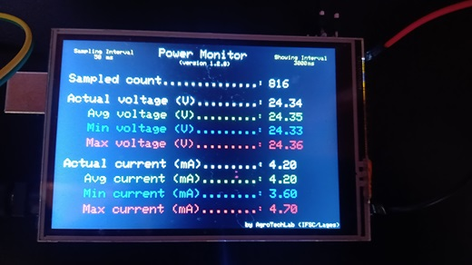

# Power Monitor 

**Power Monitor** is a IoT tool developed by <a href="https://agrotechlab.lages.ifsc.edu.br">AgroTechLab (*Technology Development 
Laboratory for Agribusiness*)</a> of <a href="https://www.ifsc.edu.br">IFSC (*Federal Institute of Santa Catarina*)</a>.

It aims to get data about the energy consumption of IoT devices. Actual, average, minimum and maximum values are sampled at each 50 ms.
This values are updated at each 3 seconds on LCD interface. It provides the following information:
* Actual voltage (in V);
* Average voltage (in V);
* Minimal voltage (in V);
* Maximum voltage (in V);
* Actual current (in mA);
* Average current (in mA);
* Minimal current (in mA);
* Maximum current (in mA);

More details can be found on the <a href="https://agrotechlab-ifsc.github.io/power_monitor">Power Monitor Documentation page</a>.

## Hardware Requirements

The following hardware are required to use Power Monitor:
* Arduino MEGA 2560;
* 3,5" TFT LCD shield;
* INA219 shield;

 

<b><a href="https://agrotechlab.lages.ifsc.edu.br/">AgroTechLab (<i>Laboratório de Desenvolvimento de Tecnologias para o Agronegócio</i>)</a></b> 
<b><a href="https://ifsc.edu.br/web/campus-lages">IFSC (<i>Instituto Federal de Santa Catarina</i>) - Câmpus Lages</a></b> 
Rua Heitor Vila Lobos, 225 - São Francisco 
Lages/SC - Brazil 
CEP: 88.506-400

