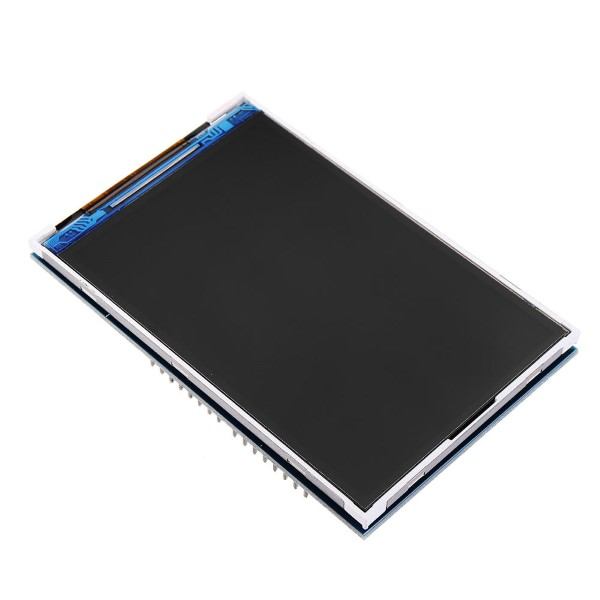

Hardware Requirements
=====================

The following **hardware requirements** are necessary to use Power Monitor:

   - Arduino Mega 2560;
   - LCD 16x2;
   - INA219 energy sensor;

Arduino Mega 2560
-----------------

The Arduino Mega 2560 is a microcontroller board based on the ATmega2560. It has 54 digital input/output pins (of which 15 can be used 
as PWM outputs), 16 analog inputs, 4 UARTs (hardware serial ports), a 16 MHz crystal oscillator, a USB connection, a power jack, 
an ICSP header, and a reset button. It contains everything needed to support the microcontroller; simply connect it to a computer 
with a USB cable or power it with a AC-to-DC adapter or battery to get started. The Mega 2560 board is compatible with most shields 
designed for the Uno and the former boards Duemilanove or Diecimila.
Key features are listed below, hardware details can be found into [datasheet](mega2560.pdf):

    - Supply voltage (recommended): 7V ~ 12V;
    - Supply voltage (limits): 6V ~ 20V;
    - Operating voltage: 5V;
    - Microcontroller: ATmega2560;
    - Digital I/O pins: 54 (of which 15 provide PWM output);
    - Analog input pins: 16;
    - DC Current per I/O Pin: 20 mA;
    - DC Current for 3.3V Pin: 50 mA;
    - Flash memory: 256Kb (8Kb used by bootloader);
    - SRAM: 8Kb;
    - EEPROM: 4Kb;
    - CPU clock: 16MHz;

.. image:: _static/mega2560.jpg
   :align: center
   :alt: Arduino Mega 2560

.. image:: _static/mega2560_pinout.png
   :align: center
   :alt: Arduino Mega 2560 Pinout

TFT LCD 3,5" Shield
-------------------

The 3,5'' TFT LCD shield is a display with 262.000 colours, 480x320 pixels of resolution and touchscreen.

Key features are listed below:
    - Supply voltage 3.3V ~ 5V;
    - 480x320 resolution;
    - 262.000 colours;
    - TFT LCD (<i>Thin Film Transistor Liquid Crystal Display</i>);
    - Resistive touchscreen;
    - LED backlight;
    - With SD card slot;
    - Arduino and STM32 compatible;

.. image:: _static/lcd2.jpg
   :align: center
   :alt: TFT LCD 3,5" schematic connection

INA219 Energy Sensor
--------------------

The INA219 is a current shunt and power monitor with an I2C- or SMBUS-compatible interface. The device monitors
both shunt voltage drop and bus supply voltage, with programmable conversion times and filtering. A programmable 
calibration value, combined with an internal multiplier, enables direct readouts of current in amperes. An additional
multiplying register calculates power in watts. The I2C- or SMBUS-compatible interface features 16 programmable addresses.

Key features are listed below, hardware details can be found into [datasheet](ina219.pdf):
    - Supply voltage 3V ~ 5.5V;
    - Operating temperature range -40ºC to 125ºC;
    - Senses Bus Voltages from 0 to 26 V;
    - 12 bits resolution;
    - Reports Current, Voltage, and Power;
    - 16 Programmable Addresses;
    - Filtering Options;
    - Calibration Registers;

.. image:: _static/ina219.jpg
   :align: center
   :alt: INA219

.. toctree::
   :name: hw_req
   :maxdepth: 2
   :caption: Hardware Requirements